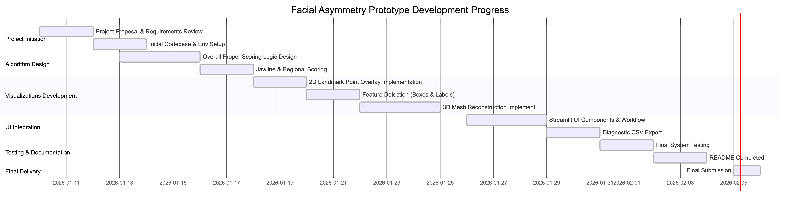
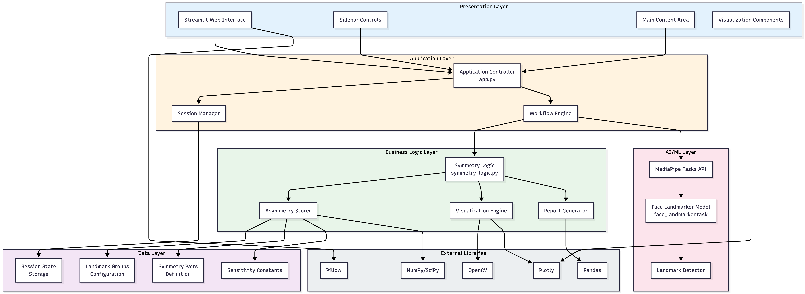
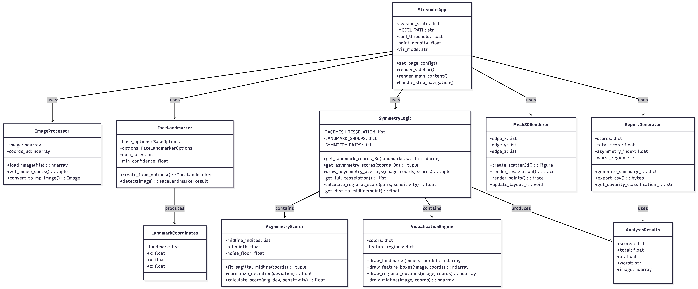
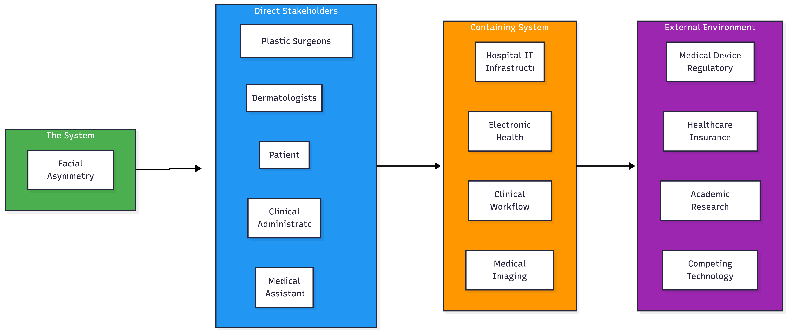
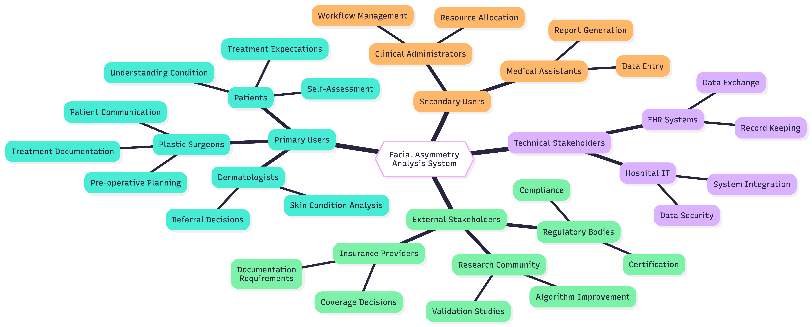
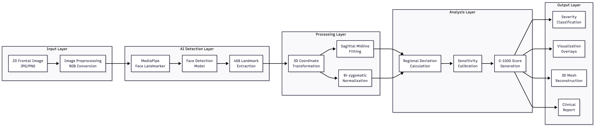
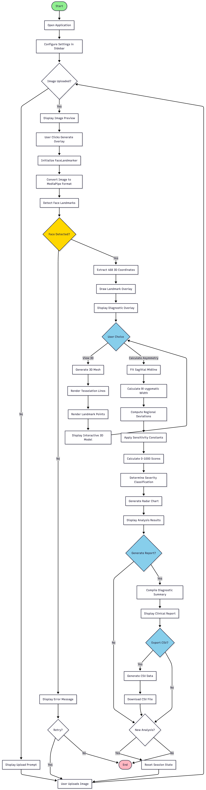

# Facial Asymmetry Pro: AI-Powered Aesthetic Analysis System

## Project Overview

Facial Asymmetry prototype is designed to provide objective, quantitative and interpretable analysis of facial asymmetry. Developed to support plastic surgery consultations and patient education, the system leverages cutting-edge computer vision and geometric morphometrics to transform subjective visual inspections into data-driven clinical insights. By utilizing the full 468-landmark MediaPipe Face Mesh, the application offers a high-fidelity 3D reconstruction and a mathematically scoring engine. This system addresses the inconsistencies of manual anthropometric measurements, providing a rapid and reproducible tool for pre-operative planning and patient-surgeon communication.

## Core Features and Implementation

### 1. High-Precision Diagnostic Workflow
The system implements a structured five-step clinical journey to ensure a seamless user experience:
* **Patient Data Input**: Secure upload of high-resolution 2D frontal images with automatic specification detection.
* **Diagnostic Point Overlay**: Real-time visualization of all 468 landmarks as high-precision points directly on the patient's photo.
* **Interactive 3D Reconstruction**: A full 3D mesh model that supports rotation, zooming and panning for volumetric inspection.
* **Volumetric Asymmetry Analysis**: Calculation of regional deviations using a re-engineered 0-1000 scoring engine.
* **Reporting**: Generation of a comprehensive diagnostic summary with CSV data export for clinical documentation.

### 2. Advanced Visualization Engine
* **Feature Detection Mode**: A professional toggle that renders labeled bounding boxes for anatomical regions (Eyes, Lips, Nose, Jawline and Face).
* **Granular Mesh Control**: Adjustable landmark point density and detection sensitivity to focus on specific structural details.
* **Interactive Radar Profiles**: Multi-dimensional visualization of regional deviations to identify primary sites of asymmetry.

### 3. High-Precision Scoring Algorithm

The prototype utilizes a high-precision diagnostic framework designed for granular structural evaluation. This system employs a 0-1000 scoring scale based on 468 3D landmarks, providing a mathematically supported assessment of facial balance. Below is explained the methematical engine:

#### 3.1. Robust Sagittal Reference Axis
To eliminate pose-dependency, the system fits a sagittal midline using a robust linear regression model ($x = my + c$) across 10 central landmarks:
- **Central Set:** Forehead (10), Bridge (168), Inter-ocular (6), Nose Tip (1), Chin (152).
- **Optimization:** The model minimizes squared perpendicular distances to ensure a stable reference axis even with minor head tilts or rotations.

#### 3.2. Multi-Dimensional Normalization
For each bilateral pair $(L_i, R_i)$, the system calculates the 3D Euclidean distance to the sagittal plane.
- **Normalization:** All deviations are normalized by the **Bi-zygomatic Width** (Landmarks 234 to 454). This ensures the analysis is scale-invariant and clinically relevant across different patient demographics.
- **3D Components:** The engine captures lateral (X) and depth (Z) asymmetries, providing a volumetric assessment of structural balance.

#### 3.3. High-Precision Scoring Formula (0-1000 Scale)
The regional score $S$ is calculated as:
$$S = \min\left(1000, \max\left(0, \frac{\bar{\delta}_{norm} - \tau}{\sigma} \times 1000\right)\right)$$
Where:
- $\bar{\delta}_{norm}$ is the mean normalized 3D deviation.
- $\tau$ is the **Symmetry Calibration Threshold** (0.0005), ensuring perfectly symmetrical faces report 0.0.
- $\sigma$ is the **Clinical Sensitivity Constant**, tuned for each anatomical region (e.g., 0.030 for Nose, 0.060 for Jawline).


#### 3.4. Severity Classification (0-1000)
- **0 - 50 (Perfect):** Exceptional symmetry; within biological noise floor.
- **50 - 250 (Mild):** Normal biological variance.
- **250 - 500 (Moderate):** Noticeable structural deviation.
- **> 500 (Severe):** Significant structural imbalance.


The system offers:
* **Robust Sagittal Midline**: A linear regression-fitted reference axis based on stable midline landmarks (Nasion, Pronasale, Philtrum, Menton).
* **Bi-zygomatic Normalization**: All deviations are normalized against the patient's facial width to ensure scale-invariant accuracy.
* **0-1000 Precision Scale**: A granular scoring system calibrated with a noise floor to handle biological variance and ensure near-perfect faces are correctly analyzed.
* **Regional Sensitivity Tuning**: Specialized constants for Ocular, Labial, Nasal and Mandibular regions to reflect clinical significance.


## Ghantt Chart

This Gantt chart visually maps prototyping tasks along the timeline. It helped track progress, dependencies, and overlaps so I can manage time effectively and complete the project on time.




## System Architecture
This diagram illustrates the three-tier structure (Presentation, Application, and Data layers). The diagram shows the following flow:
- Presentation Layer: The web interface where the user/patient/clinician interacts with the system.
- Application Layer: The AI analysis engine that coordinates the data flow and processing.
- Data Layer: Includes the landmark detection model, asymmetry calculation algorithms, and the analysis results database.

This provides a clear overview of the system's structural components and their interactions.



## Class Descriptions
The Class Diagram below details the primary software components and their relationships, illustrating the object-oriented design of the application.

| Class | Responsibility | Key Methods |
|-------|---------------|-------------|
| StreamlitApp | Main application controller managing UI flow and state | render_sidebar(), handle_step_navigation() |
| ImageProcessor | Handles image loading and preprocessing | load_image(), convert_to_mp_image() |
| FaceLandmarker | MediaPipe face detection wrapper | detect(), create_from_options() |
| SymmetryLogic | Core asymmetry calculation algorithms | get_asymmetry_scores(), draw_asymmetry_overlays() |
| AsymmetryScorer | Mathematical scoring engine | fit_sagittal_midline(), calculate_score() |
| VisualizationEngine | Rendering overlays and annotations | draw_landmarks(), draw_feature_boxes() |
| Mesh3DRenderer | 3D Plotly visualization | create_scatter3d(), render_tesselation() |
| ReportGenerator | Clinical report and export functionality | generate_summary(), export_csv() |



## Onion Model - Stakeholder Analysis


### Stakeholders Mindmap



## Stakeholder Analysis Table

| Stakeholder | Role | Interest Level | Influence Level | Key Concerns |
|-------------|------|----------------|-----------------|--------------|
| **Plastic Surgeons** | Primary User | High | High | Accuracy, reliability, clinical utility |
| **Patients** | End Beneficiary | High | Medium | Understanding results, privacy |
| **Dermatologists** | Secondary User | Medium | Medium | Integration with existing workflow |
| **Clinical Administrators** | Operations | Medium | High | Cost, efficiency, compliance |
| **Medical Assistants** | Support Staff | Medium | Low | Ease of use, training requirements |
| **Hospital IT** | Technical Support | Low | High | Security, integration, maintenance |
| **Regulatory Bodies** | Oversight | Low | Very High | Safety, efficacy, compliance |
| **Insurance Providers** | Payers | Low | High | Documentation, medical necessity |
| **Research Community** | Knowledge | Medium | Low | Methodology, reproducibility |


## AI/ML Pipeline Diagram - Facial Asymmetry Analysis


#### Algorithm Mathematical Foundation

| Component | Formula/Method | Purpose |
|-----------|---------------|---------|
| Sagittal Midline | x = my + c (Linear Regression) | Pose-independent reference axis |
| Distance to Midline | d = \|x - my - c\| / √(1 + m²) | Perpendicular distance calculation |
| Normalization | δ_norm = deviation / bi-zygomatic_width | Scale-invariant measurement |
| Regional Score | S = ((δ_avg - τ) / σ) × 1000 | 0-1000 precision scale |
| Noise Floor | τ = 0.001 | Biological variance threshold |
| Sensitivity Constants | σ = {0.04 - 0.08} per region | Clinical significance tuning |

## Activity Flow Description



| Phase | Activities | Decision Points |
|-------|-----------|-----------------|
| Initialization | Open app, configure settings | - |
| Image Input | Upload image, display preview | Image uploaded? |
| Detection | Initialize landmarker, detect face | Face detected? |
| Visualization | Draw overlay, optional 3D view | View 3D or Calculate? |
| Analysis | Fit midline, compute scores | - |
| Reporting | Generate summary, export CSV | Generate report? Export CSV? |
| Completion | Reset or end session | New analysis? |

## Sequence Diagram


### Sequence Flow Description

| Step | Action | Components Involved | Output |
|------|--------|---------------------|--------|
| 1 | Image Upload | User → UI → ImageProcessor | Image array with specifications |
| 2 | Landmark Detection | UI → FaceLandmarker → SymmetryLogic | 468 3D landmark coordinates |
| 3 | 3D Visualization | UI → Mesh3DRenderer | Interactive Plotly 3D figure |
| 4 | Asymmetry Analysis | UI → SymmetryLogic | Regional scores, total score, AI |
| 5 | Report Generation | UI → ReportGenerator | Clinical diagnostic summary |
| 6 | Data Export | UI → ReportGenerator | CSV file download |


## Technical Specifications

* **Language**: Python 3.10
* **AI Framework**: MediaPipe Tasks API (Face Landmarker)
* **Interface**: Streamlit
* **Data Visualization**: Plotly, OpenCV
* **Mathematical Engine**: NumPy, SciPy

## Installation and Setup

To ensure a stable environment, it is recommended to use a dedicated Conda environment.

### 1. Environment Configuration
Open your terminal and execute the following commands:
```bash
# Create a dedicated Conda environment
conda create -n facial_pro python=3.10 -y

# Activate the environment
conda activate facial_pro
```

### 2. Dependency Installation
Navigate to the project directory and install the required packages:
```bash
pip install -r requirements.txt
```

### 3. Running the Application
Launch the professional diagnostic interface:
```bash
streamlit run app.py
```

## Clinical Significance and Future Directions

This prototype fulfills the objectives outlined in the submitted project proposal by providing an accessible, objective and automated pre-consultation analysis tool. It bridges the gap between subjective assessment and high-end 3D imaging systems, offering clinical-grade accuracy without the need for specialized hardware. Future research directions include the integration of multi-modal 2D+3D imaging, real-time video-based analysis and longitudinal tracking of facial changes to monitor post-recovery and long-term aesthetic outcomes.

## **References**

The prototype implementation was informed by existing open-source computer vision applications using MediaPipe and Streamlit (Polinowski), and symmetry estimation logic was also studied for repos demonstrated in facial landmark analysis repositories (Jnahi, Kamilla).

[1] Polinowski, M. Streamlit computer vision applications using MediaPipe [GitHub](https://github.com/mpolinowski/streamLit-cv-mediapipe)

[2] Jnahi, Y. Facial symmetry estimation using facial landmarks [GitHub](https://github.com/yousrajnahi/Facial-symmetry-estimation)

[3] Kamilla. Face symmetry analysis using dlib facial landmarks [GitHub](https://github.com/kissakova/Face-Symmetrydlib)